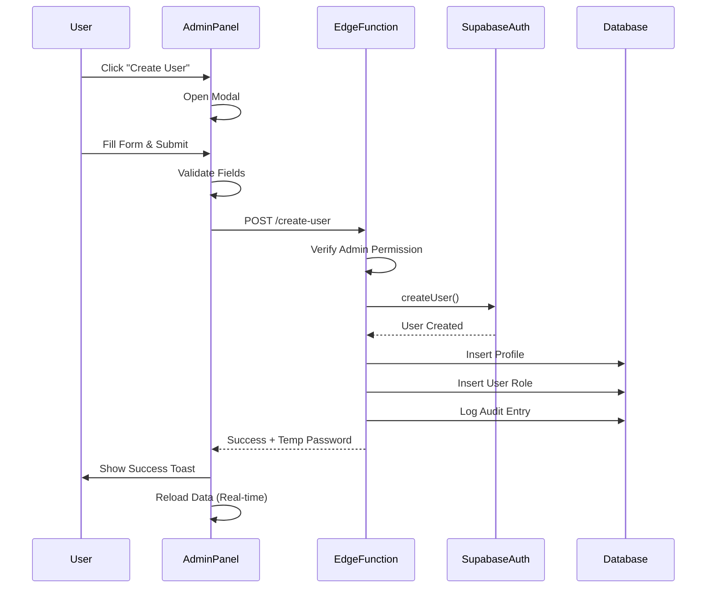

# Create User Feature - Complete Implementation

## Overview
Fully functional user creation system in Admin Panel with Supabase Admin API integration.

## Components

### 1. Edge Function: `create-user`
**Location**: `supabase/functions/create-user/index.ts`

**Purpose**: Server-side user creation with Admin API access

**Features**:
- ✅ Creates user in auth.users using Admin API
- ✅ Auto-generates password if not provided
- ✅ Auto-confirms email for admin-created users
- ✅ Creates profile record in public.profiles
- ✅ Assigns initial role in user_roles table
- ✅ Logs admin action in user_audit_log
- ✅ Rollback on failure (deletes auth user if profile/role fails)
- ✅ Permission check (only admins can create users)

**Security**:
- Requires valid auth token
- Verifies user has admin/super_admin role
- Uses SUPABASE_SERVICE_ROLE_KEY for admin operations
- Proper CORS headers

**Request Body**:
```json
{
  "email": "user@example.com",
  "full_name": "John Doe",
  "password": "optional-password",
  "role": "production",
  "department_id": "uuid-or-null",
  "is_active": true
}
```

**Response**:
```json
{
  "success": true,
  "user": {
    "id": "uuid",
    "email": "user@example.com",
    "full_name": "John Doe",
    "role": "production",
    "department_id": "uuid",
    "is_active": true
  },
  "temporary_password": "auto-generated-if-not-provided"
}
```

### 2. Admin Panel Modal
**Location**: `src/pages/Admin.tsx`

**Fields**:
1. **Full Name** (required)
   - Text input
   - Validates non-empty

2. **Email** (required)
   - Email input with validation
   - Regex check for valid format

3. **Password** (optional)
   - Type: password
   - Auto-generated if left blank
   - Temporary password shown in success toast

4. **Role** (required)
   - Dropdown from roles array
   - Default to first role or "unassigned"
   - Safe Select implementation

5. **Department** (optional)
   - Dropdown from departments table
   - "No Department" option available
   - Safe Select implementation

6. **Status** (active/inactive)
   - Switch component
   - Default: Active (true)
   - Sets is_active in profile

**Validation**:
```typescript
// Required fields
if (!newUser.email || !newUser.full_name || !newUser.role) {
  // Show error toast
}

// Email format
const emailRegex = /^[^\s@]+@[^\s@]+\.[^\s@]+$/;
if (!emailRegex.test(newUser.email)) {
  // Show error toast
}
```

**Loading States**:
- `creatingUser` state variable
- Disables all form fields during creation
- Shows spinner in button
- Prevents double-submission

## User Creation Flow



## Error Handling

### Client-Side Errors
1. **Missing Required Fields**
   ```typescript
   toast({
     title: "Validation Error",
     description: "Please fill in all required fields (Name, Email, Role)",
     variant: "destructive",
   });
   ```

2. **Invalid Email Format**
   ```typescript
   toast({
     title: "Validation Error",
     description: "Please enter a valid email address",
     variant: "destructive",
   });
   ```

3. **No Active Session**
   ```typescript
   throw new Error('No active session');
   ```

### Server-Side Errors
1. **Permission Denied**
   ```typescript
   throw new Error('Insufficient permissions - Admin access required');
   ```

2. **User Already Exists**
   - Supabase returns error if email exists
   - Shown in toast notification

3. **Profile Creation Failed**
   - Automatically deletes auth user (rollback)
   - Returns error to client

4. **Role Assignment Failed**
   - Automatically deletes auth user and profile (rollback)
   - Returns error to client

## Success Flow

1. User created in auth.users
2. Email auto-confirmed
3. Profile created in public.profiles
4. Role assigned in user_roles
5. Admin action logged
6. Success toast shown with temp password (if generated)
7. Form reset and modal closed
8. User table refreshes via real-time subscription

## Code Examples

### Creating a User
```typescript
const response = await fetch(
  `${SUPABASE_URL}/functions/v1/create-user`,
  {
    method: 'POST',
    headers: {
      'Content-Type': 'application/json',
      'Authorization': `Bearer ${session.access_token}`,
    },
    body: JSON.stringify({
      email: "new@example.com",
      full_name: "New User",
      password: "optional",
      role: "production",
      department_id: "dept-uuid",
      is_active: true,
    }),
  }
);
```

### Handling Response
```typescript
const result = await response.json();

if (!result.success) {
  throw new Error(result.error);
}

// Show success with temp password if generated
toast({
  title: "Success",
  description: result.temporary_password 
    ? `User created. Temp password: ${result.temporary_password}` 
    : "User created successfully",
});
```

## Security Considerations

### ✅ Implemented
1. **Admin-Only Access**
   - Edge function checks user role
   - Only admin/super_admin can create users

2. **Service Role Protection**
   - Service role key never exposed to client
   - Only used in edge function

3. **Email Validation**
   - Client-side regex validation
   - Server-side Supabase validation

4. **Audit Logging**
   - Every user creation logged
   - Includes admin who created user
   - Timestamp and details recorded

5. **Rollback on Failure**
   - If profile fails, auth user deleted
   - If role fails, both auth user and profile deleted
   - Maintains data consistency

### 🔒 Best Practices
1. Force password change on first login (can be added)
2. Email verification link sent (currently auto-confirmed)
3. Rate limiting on edge function (can be added)
4. Password complexity requirements (can be added)

## Testing Checklist

- [x] Modal opens and closes properly
- [x] All form fields work correctly
- [x] Required field validation works
- [x] Email format validation works
- [x] Role dropdown shows all roles
- [x] Department dropdown shows all departments
- [x] Status switch toggles correctly
- [x] Loading state disables form
- [x] Edge function creates user successfully
- [x] Profile record created
- [x] Role assigned correctly
- [x] Department assigned correctly
- [x] Temp password generated when blank
- [x] Success toast shows
- [x] Table refreshes with new user
- [x] Error handling works
- [x] Rollback works on failure
- [x] Permission check prevents non-admins
- [x] Audit log entry created

## Future Enhancements

1. **Email Templates**
   - Custom welcome email
   - Include temp password
   - Setup instructions

2. **Bulk User Import**
   - CSV upload
   - Validate all users before creation
   - Progress indicator

3. **Password Requirements**
   - Configurable complexity rules
   - Strength indicator
   - Password history

4. **User Invitation Flow**
   - Send invitation email
   - User sets own password
   - Confirm email before activation

5. **Role Templates**
   - Predefined role combinations
   - Quick assign multiple permissions
   - Department-based defaults

## Troubleshooting

### User Creation Fails
1. Check edge function logs: `supabase functions logs create-user`
2. Verify SUPABASE_SERVICE_ROLE_KEY secret exists
3. Check user has admin role
4. Verify email doesn't already exist
5. Check database connection

### Temporary Password Not Shown
- Only shown when password field left blank
- Check success toast message
- Password is in response.temporary_password

### Real-time Update Doesn't Work
- Check Supabase real-time subscription
- Verify profiles channel is subscribed
- Check browser console for errors
- Manually reload data as fallback

### Permission Denied Error
- User must have 'admin' or 'super_admin' role
- Check user_roles table
- Verify RLS policies allow read access
